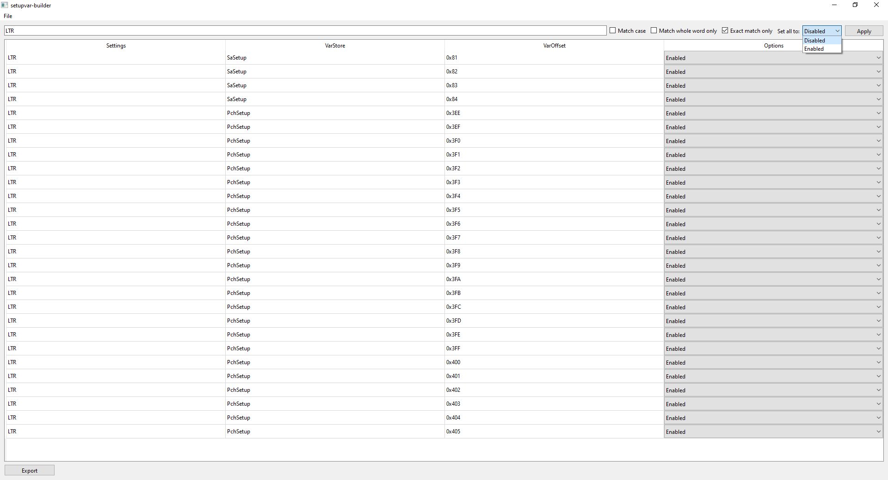

# setupvar-builder

[](https://github.com/ab3lkaizen/setupvar-builder/releases)

`setupvar-builder` provides a UI for building scripts that you can later run using [setup_var.efi](https://github.com/datasone/setup_var.efi). `setup_var.efi` has the ability to read and write NVRAM variables, including those not visible through the UEFI.



## Disclaimer

I am not responsible for any damage that may occur to your computer. This tool is powerful and intended for advanced users only. There is a risk of damaging your hardware by altering unknown settings, particularly those related to basic system functionality. It is your responsibility to be informed about the desired settings and their impact on the system.

## 1. Usage

### 1.1 Prerequisites

> [!WARNING]
> The generated script complies only with the syntax of setup_var.efi version `0.2.x`!

- BIOS image
- [UEFITool NE](https://github.com/LongSoft/UEFITool/releases/latest)
- [IFRExtractor-RS](https://github.com/LongSoft/IFRExtractor-RS/releases/latest)
- [setupvar-builder](https://github.com/ab3lkaizen/setupvar-builder/releases/latest)
- [setup_var.efi](https://github.com/datasone/setup_var.efi/releases) (version `0.2.x`)
- USB drive

### 1.2 Extracting and converting the required file

1. Obtain the BIOS from the official site of your motherboard manufacturer. Ensure it is the same version that is currently flashed on your motherboard.

2. Drag and drop the BIOS file into `UEFITool NE`

3. Search (CTRL + F) for a known setting, such as `Above 4G Decoding`

4. Double-click the reference to `Setup/PE32 Image section` at the bottom

5. Right-click on the highlighted `PE32 Image section` and click `Extract as is...`

6. Move `ifrextractor.exe` to the current folder or use the full path. Open the CLI and convert the `.sct` file you just extracted into human-readable text with the following command:

    ```bat
    ifrextractor.exe "Section_PE32_image_Setup_Setup.sct" verbose
    ```

### 1.3 setupvar-builder

1. Open `setupvar-builder.exe`

2. Click on `File > Open` (CTRL + O) and select the converted IFR data

3. Change the desired setting(s)
    - Use the search function and its filters
        - Refer to this [cheatsheet](https://www.w3schools.com/python/python_regex.asp) for possible regular expression patterns
    - Use the bulk setting adjustment feature (top-right corner) if you want to change multiple settings of the same type and name

4. Click on the `Export` button in the left bottom corner (CTRL + S) and save the script file

### 1.4 Preparing the USB drive

1. Format a USB drive as `FAT32`

2. Download a UEFI shell from one of the following sources:
    - [UEFI-Shell](https://github.com/pbatard/UEFI-Shell/releases/latest) (`shellx64.efi`)
    - Official [EDK2 stable releases](https://github.com/tianocore/edk2/releases/download/edk2-stable202002/ShellBinPkg.zip) (`ShellBinPkg > UefiShell > X64 > Shell.efi`); note that this shell might be outdated

3. Rename the UEFI shell to `BOOTX64.EFI` and put it in `USB:\EFI\BOOT`

4. Put `setup_var.efi` and `setupvar-script.nsh` in the root of the USB drive

### 1.5 setup_var.efi

1. Boot from the USB drive

2. Select your USB drive by typing its map identifier:
    - Examine the **Mapping Table** that is displayed by default. If you have cleared the CLI, type `map` to redisplay it.
    - Most likely, it will be `FS0:`

3. Run the script file with the following command:

    ```sh
    .\setupvar-script.nsh
    ```

## Troubleshoot

If you encounter any errors, please report the issue through the [issue tracker](https://github.com/ab3lkaizen/setupvar-builder/issues). Consider whether your problem is covered by an existing issue; if so, follow the discussion there. Avoid commenting on existing recurring issues, as such comments do not contribute to the discussion of the issue and may be treated as spam.
